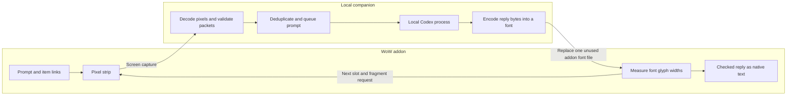

<p align="center">
  
</p>

<h1 align="center">Azeroth Codex</h1>

<p align="center"><strong>Native, bounded chat between WoW: Forever and a local Codex process.</strong></p>

<p align="center">Version 0.4.7 · Experimental transport · Windows + NTFS · Python 3.12+</p>

Prompts leave the game through a small on-screen pixel strip. Replies return as checked UTF-8 bytes encoded in ordinary addon font metrics, then render as normal scrollable text. The bridge uses documented addon APIs only: no injection, process-memory access, simulated input, or executable response payloads.

> **Status:** verified in the tested Forever client. Finite first-use font slots and runtime behavior on other builds remain experimental.

## Start Here

| Goal | Read |
| --- | --- |
| Install or upgrade safely | [Agent installation guide](AGENTS.md) |
| Understand the complete transport | [How it works](#how-the-two-way-channel-works) |
| Set up the addon and companion | [Install](#install) and [Run the companion](#run-the-companion) |
| Work on the codebase | [Development](docs/development.md) |
| Verify changes or live behavior | [Testing](docs/testing.md) |
| Inspect protocol and safety boundaries | [Architecture](docs/architecture.md) |
| Understand storage and finite capacity | [Font bank](docs/font-bank.md) |
| Review restart reuse evidence | [Font recycling experiment](docs/font-recycling.md) |

## At A Glance

| Direction | Carrier | Receiver |
| --- | --- | --- |
| WoW to companion | 128 x 4 pixel strip | Screen capture + checked packet decoder |
| Companion to WoW | First-use TrueType font metrics | Documented `SetFont`, `SetText`, and `GetStringWidth` |

Once installed and loaded, ordinary messages need no `/reload`.

This is an experimental, finite transport built around documented addon APIs. It uses no DLL injection, game-process memory access, anti-cheat bypass, generated keyboard/mouse input or executable reply payloads. Using documented APIs does not imply Blizzard endorsement.

## Features

- Native chat/status frame with `/codex`, hide/show, minimap toggle and completion badge.
- Shift-click or drag items into a focused draft. Item references in responses can become native links with tooltips.
- Checked UTF-8 replies, multipart assembly, stale-packet rejection and automatic retry after missed writes.
- A **65,535-slot** font bank with compact shared placeholders and isolated writes.
- A Windows companion with capture controls, persistent inbox, reply notifications and a local Codex adapter. The default agent sandbox is read-only.

## How the two-way channel works

The bridge combines two different paths. **WoW sends data by drawing pixels that the companion can capture. The companion sends data back by preparing an unused font that WoW can load and measure.** After decoding, the reply is an ordinary Lua string displayed with the game's normal text UI.

| Direction | Carrier | What the receiver reads |
| --- | --- | --- |
| WoW → companion | A small black-and-white pixel strip | Bits sampled from a screen capture |
| Companion → WoW | An existing, previously unused addon font file | Numbers returned by font-width measurements |



### 1. WoW sends the prompt through pixels

When you press Send, the addon converts the prompt to UTF-8 bytes and assigns a request number within the current UI session. Linked items are normalized into text containing the item's name, ID and available details before transmission.

The strip has **128 columns × 4 rows = 512 binary cells**. A black cell represents zero and a white cell represents one. Eight cells encode one byte, so each displayed frame carries **64 bytes**. At the nominal four-pixel cell size, the strip occupies 512 × 16 screen pixels. It is a custom binary grid; there is no QR-code scanner or OCR involved.

A prompt packet contains a 20-byte header, up to 40 bytes of prompt data with zero padding, and a four-byte Adler-32 checksum. The header identifies the packet type, UI session, request and fragment. Longer prompts use up to 32 fragments, giving a **1,280 UTF-8 byte** prompt limit. Bytes and characters differ: some characters require several bytes.

The addon updates the strip on a roughly 250 ms cadence. While receiving a reply, it alternates prompt frames with return-channel control frames. It cycles through fragments from up to eight recent prompts so missed captures can be recovered. The companion samples the center of each cell in the configured crop, rejects ambiguous colors or bad checksums, and reassembles complete prompts. An occluded or misaligned crop is rejected rather than interpreted as a message.

The durable inbox uses the session/request pair as its key. Repeated optical packets therefore do not repeatedly launch Codex. Accepted prompts enter the local worker queue; the adapter starts `codex exec --json` with the prompt on standard input. It collects actual assistant-message events and completion state. Recent completed exchanges from the same UI session provide bounded conversation context for follow-up requests.

### 2. The strip also schedules the return path

The second kind of optical packet, **CPBN**, tells the companion:

- Which request the addon is currently displaying.
- Which unused font slot it will load next.
- How much time remains before that load.
- Which reply fragment it needs next.
- Whether reception is active, and which slot was last attempted.

Conceptually, the addon says: “For this session and request, prepare fragment 2 in slot N before the countdown ends.” The companion looks up that request's latest status/reply and prepares the matching packet. If the prompt has not arrived yet, it can send a waiting status.

The first normal write window is six seconds; subsequent windows are normally five seconds. The companion leaves a 750 ms margin, refuses writes with less than one second advertised, and checks its deadline again before publication. Repeated captures cannot extend that deadline. Once the addon starts reading a font, it advertises zero time remaining so the writer stops touching that slot.

Each slot's packet is frozen for that attempt. A newer agent response waits for a later slot instead of changing a file the game may already be loading. **Writing a file is not proof of delivery.** The `loaded` counter means “last attempted slot,” including failed attempts; requested fragment numbers and the active/idle state communicate the receiver's progress.

### 3. The companion encodes reply bytes as font widths

The installation creates a bank of known addon font filenames before the game discovers its resources. The companion publishes a response by writing a complete temporary TrueType font and atomically replacing one **previously unused** bank file.

The font contains 512 data glyphs, one for each byte position in a checked response packet. Their Unicode code points begin at U+E000. The glyph's **advance width**—the amount of horizontal space it occupies—encodes a value from 0 to 255. The shapes themselves do not contain readable reply text.

The generated metric for a byte is:

```text
advance in font units = (16 + byte_value) × 16
font units per em     = 1024
measurement font size = 64
```

At that nominal size, the data glyph's advance corresponds to `16 + byte_value` width units. Two calibration glyphs represent byte values 0 and 255. The addon appends the same trailing glyph (`~`) to every measurement, so the trailing contribution cancels when it calculates:

```text
low  = width(calibration_0   + "~")
high = width(calibration_255 + "~")
read = width(data_glyph      + "~")

byte_value = round((read - low) × 255 / (high - low))
```

For example, nominal measured widths of `low = 48`, `high = 303`, and `read = 113` decode to **65**. That is the byte value used for an ASCII `A`, though a packet byte may instead be part of a header, checksum or multi-byte UTF-8 character. The private-use glyph selects a packet position, not a letter in the final response.

On the WoW side, an invisible FontString uses documented `SetFont`, `SetText` and `GetStringWidth` calls. It retries asynchronous font assignment and checks calibration before decoding. Measurements outside 0–255 or more than 0.20 from an integer are rejected. Work is limited to 32 packet-glyph measurements per game frame.

**The addon never reads the font file as raw bytes.** The game loads a normal font resource; Lua reads its measurable properties. The generated font contains ordinary outlines and metrics, with no TrueType instruction bytecode. The recovered bytes are checked data, never executable Lua or game commands.

### 4. Checked packets become normal in-game text

A native reply packet is **512 bytes**: a 32-byte header, a 476-byte payload area and a four-byte checksum. Its header includes the state, payload length, session, request, slot, content revision and fragment number/count. The receiver checks those fields, padding and checksum before accepting a fragment.

| Packet | Carrier | Layout | Purpose |
| --- | --- | --- | --- |
| CPB1 v1 | Pixels, 64 bytes | 20-byte header + 40-byte padded payload + 4-byte checksum | Outbound prompt fragments |
| CPBN v2 | Pixels, 64 bytes | 20-byte header + 20-byte controls + 20-byte padding + 4-byte checksum | Slot timing and requested reply fragment |
| CFN1 v1 | Font metrics, 512 bytes | 32-byte header + 476-byte padded payload + 4-byte checksum | Inbound reply/status fragments |

Multi-byte integers are big endian. All three packet types use Adler-32. These checks detect transmission errors and stale packets; they are not encryption or authentication against another local program capable of forging packets.

Replies longer than 476 bytes use multiple fonts. For example, a stable **700-byte reply** needs two payloads: 476 bytes and 224 bytes. The addon accepts fragment 1, advertises a fresh slot and requests fragment 2, then joins the payloads and renders the complete text. Status updates, missed writes or changing revisions may consume additional slots, so two payloads do not guarantee that only two bank files will be used.

The revision is a checksum of the complete preview text and state. If a new revision arrives halfway through, the receiver discards the previous revision's partial assembly and requests fragment 1 again. UTF-8 characters can cross packet boundaries safely because display happens after assembly. The preview is capped at 60,000 UTF-8 bytes; the companion keeps the full response.

The final string goes into a normal scrolling text frame. Raw WoW markup is escaped. Supported item references are validated against game-provided metadata and converted into native item links. No response screenshot is being painted into the chat panel, and no OCR is needed to recover text.

### 5. Completion, retries and the flashing strip

The packet state distinguishes waiting, queued, working, streaming, done, failed and interrupted. The addon raises its completion badge only after decoding a complete final-state reply. It then pauses reception and emits a steady inactive control frame; the next Send resumes the channel. The companion's desktop notification is separate and can occur earlier, when the agent finishes locally.

The strip therefore flashes during both prompt transmission and reply transfer. It may keep changing after Codex finishes while remaining reply fragments arrive. A changing strip alone does not indicate that the agent is still generating an answer. Once a complete final reply has arrived, ordinary transport becomes idle. Explicit diagnostic probes can temporarily use the strip for their own bounded reports.

If no writer reaches a slot before its first load, the addon reads a recognizable zero-filled baseline packet. It keeps existing reply fragments, advances to another slot and retries with delays of 10, 20, then at most 30 seconds. Three consecutive real loading/corruption errors pause reception. Each watch also has a 20-minute limit. Replies remain in the companion if in-game delivery fails or the watch expires.

### 6. Why there are 65,535 files

The successful live behavior depends on **first use of an existing filename in the current game process**. In the tested client, rewriting a font path after it had been loaded continued to return cached data. New filenames created after UI load were not discovered by the tested routes. Precreating many names lets the bridge move forward through unused resources without a per-message reload.

The bank runs from `fontreply0001.ttf` through `fontreply65535.ttf`. The filename format uses a minimum of four digits, so five-digit slots work naturally. The transport carries slot numbers in 32-bit fields; 65,535 is the chosen bank capacity, not the wire format's maximum. Slot 65,536 is an inactive exhaustion marker and is never written as a font file.

Initially, groups of up to 512 filenames share one valid blank font through NTFS hard links. A fresh bank needs only 128 underlying baseline files: about **2.81 MB of font payload**, plus filesystem metadata. Atomic replacement detaches the selected filename when a reply is published, leaving the other blank slots untouched. Storage grows as more slots receive independent packets. Writing through a shared file in place would corrupt its siblings, which is why replacement matters.

The addon saves its next-slot counter before requesting a font. Beta settings restoration has sometimes lost that counter; the receiver can read past checked stale packets to reach a fresh slot. It never treats that recovery as cache eviction or resets the bank. Automatic recycling is not implemented, and exhaustion leaves the full responses available in the companion.

**Full-restart reuse was verified on September 21, 2026:** two previously loaded diagnostic font filenames delivered new bytes after the client process restarted, including a value written after startup but before its first read. This supports a future recycler; restarting today still preserves the saved counter. The live checks used 64-byte diagnostic packets, not a reset of the full production bank. [Experiment, results and limits](docs/font-recycling.md).

A one-time reload is needed for changed addon code and resource discovery after installation; a client restart may be needed if new names remain unknown. Ordinary exchanges then use the already prepared bank. Documented font APIs provide the measurement operations, while this first-use file-loading behavior is an empirical result from the tested build, not a guaranteed general-purpose file/IPC API.

### Implementation map

| Responsibility | Source |
| --- | --- |
| Draw the strip, assign request IDs and handle Send | [Main.lua](addon/CodexPixelBridge/Main.lua) |
| Encode/decode prompt packets and sample captured pixels | [Protocol.lua](addon/CodexPixelBridge/Protocol.lua), [protocol.py](companion/protocol.py) |
| Validate optical control packets | [visual.py](companion/visual.py) (`parse_control`; this module also retains the earlier image prototype) |
| Capture the strip, deduplicate requests and publish replies | [app.py](companion/app.py) |
| Run the agent and collect real response events | [agent_stream.py](companion/agent_stream.py) |
| Include recent conversation history | [conversation.py](companion/conversation.py) |
| Build response packets/fonts and publish them atomically | [native.py](companion/native.py) |
| Measure fonts, schedule slots and update the in-game frame | [Native.lua](addon/CodexPixelBridge/Native.lua) |
| Validate and assemble decoded reply fragments | [NativeProtocol.lua](addon/CodexPixelBridge/NativeProtocol.lua) |
| Generate compact banks and fixed probe assets | [install_addon.py](tools/install_addon.py) |

The earlier image-response implementation remains in the repository for diagnostic history. The current addon manifests load the native font-byte receiver for normal replies. [Architecture reference](docs/architecture.md) · [Font-bank storage](docs/font-bank.md) · [Observed behavior and tests](docs/testing.md).

## Requirements

- Windows with NTFS for compact font installation.
- WoW: Forever; development and live experiments used **1.60.1.69913 / TOC 16001**. Other builds are unverified.
- Python 3.12+ with tkinter.
- An authenticated native Codex CLI for the real backend. The mock backend needs no agent login.
- Windowed or borderless WoW with the pixel strip visible and unobscured.

## Install

**Installing with an agent?** Start with [AGENTS.md](AGENTS.md) for path discovery, safe upgrades, persistent companion configuration and end-to-end verification.

From this repository's folder:

```powershell
python -m venv .venv
.\.venv\Scripts\python.exe -m pip install -r requirements.txt
.\.venv\Scripts\python.exe -m tools.install_addon 'C:\path\to\World of Warcraft\_classic_beta_\Interface\AddOns\CodexPixelBridge'
```

Use your actual game path. The installer copies addon code, generates the font/image resources and preserves existing resource files. **Do not just copy the addon source folder:** generated assets are intentionally excluded from Git and source archives. Fonts can contain response data and ordinary copies also lose their compact shared storage.

Enable the addon and load WoW. If updating while playing, manually `/reload` once to load new Lua and asset names. Fully restart WoW if new assets remain undiscovered. The title should say **Codex | Live text 0.4.7**. Never reset or replace a used font bank while the game is running.

## Run the companion

```powershell
.\.venv\Scripts\python.exe -m companion.app --backend codex --project 'C:\path\to\work-project' --codex 'C:\path\to\codex.exe' --addon 'C:\path\to\World of Warcraft\_classic_beta_\Interface\AddOns\CodexPixelBridge'
```

Use an existing work directory, separate from the game installation. In the companion, set the capture crop to the strip's exact desktop coordinates: left, top, width, height. The nominal strip is 512 by 16 at (8, 8), but display scaling changes those values. Start capture, open `/codex` and send a short message. Capture calibration is saved locally.

To test without calling an agent, replace `--backend codex` with `--backend mock` and omit `--codex`. The adapter normally runs `codex exec --json --sandbox read-only`; `--sandbox workspace-write` is an explicit opt-in to project edits. No bypass mode is provided.

`Launch Companion.pyw` is an optional Windows launcher that remembers your work folder and discovers the CLI. For an initial installation, the command above also supplies the addon path explicitly.

## In-game controls

| Action | Control |
| --- | --- |
| Show/hide the panel | `/codex`, `/cpb`, minimap C button, or addon keybinding |
| Explicit visibility | `/codex show`, `/codex hide` |
| Send a prompt | Enter or Send in the message box |
| Link an item | Focus the message box and Shift-click an item, or drag it into the box |
| Pause/resume receiving | `/codex pause`, `/codex resume`, or panel buttons |
| Clear repeating prompts | `/codex clear` (already received agent jobs continue) |
| Read a response item link | Hover/click; Shift-click inserts it into a draft without sending |

The strip changes while transmitting prompts or receive timing. Duplicate prompt packets do not create duplicate jobs. A fully received final response raises the completion badge and leaves the strip steady. A new prompt resumes transfer.

## Limits and verification

The font bank is finite and does not automatically recycle. Each font carries a 512-byte packet with up to 476 response bytes. A fresh slot is requested roughly every five seconds while watching, plus assignment/decoding time. Replies are displayed as complete checked revisions; token-by-token streaming is not guaranteed.

The preview limit is 60,000 UTF-8 bytes. The companion retains the full response. Each receive watch stops after 20 minutes, three consecutive real loading/corruption failures, or a completed response. Lost saved counters can require reading past cached old slots. Keep the strip visible while receiving.

The native channel has delivered real responses and completion notifications in the tested client. Shared placeholders delivered fresh bytes in two live experiments, and diagnostic font filenames were successfully reused after a full client restart. Full-bank recycling, startup performance and live use of slot 65,535 remain unverified. Native item-link mouse behavior and the split-stack fix still need broader live verification.

**87 local tests pass**, including production Lua 5.1, real font measurements, consecutive multipart replies, the last slot, replacement-prompt slot retirement and a clean-source installer. [Testing](docs/testing.md).

## Local data

`state/` contains the inbox, preferences, capture calibration and bounded transport logs. Normal operation captures only the selected strip and does not save screenshots. Prompt and reply text persists in the local inbox and can also be encoded in installed fonts. Keep the inbox to prevent replay of repeated request IDs. Do not commit runtime data or generated assets.

[Architecture](docs/architecture.md) · [Font bank](docs/font-bank.md) · [Development](docs/development.md) · [Testing](docs/testing.md)
